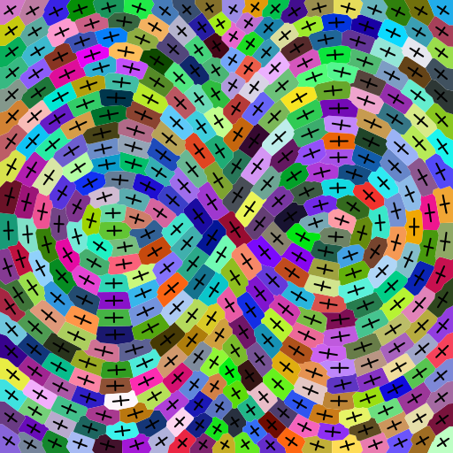

# InfinityVoronoi

### Constructing L∞ Voronoi Diagrams in 2D and 3D
[](https://ls7-gv.cs.tu-dortmund.de/downloads/publications/2022/sgp22.pdf)
[](https://doi.org/10.1111/cgf.14609)

Our implementation generates Voronoi Diagrams for given sets of sites with parameterized orientation- and anisotropy-fields in 2D and 3D.

## Dependencies


Most libraries are part of the Python Standard Library (tested with 3.8.10).

The only **actually required** library is [NumPy](https://github.com/numpy/numpy).

**Optionally**, 
* [matplotlib](https://github.com/matplotlib/matplotlib) shows 2D results,
* [Mayavi](https://github.com/enthought/mayavi) visualizes 3D results and
* [tqdm](https://github.com/tqdm/tqdm) realizes progress bars in the shell.

## Run Examples
* In the main directory, there are two scripts generating 2D and 3D example results.
Just run `python runExamples2D.py` or `python runExamples3D.py`, respectively.
These files contain exemplary setups to recreate results from the paper, i.e., L∞ Voronoi Diagrams with different orientation and anisotropy fields or Lloyd relaxations generating CVTs.
* To recreate a 2D diagram as shown above, run `python ChebyshevObject2D.py`.
* Results are stored as `.obj` files, 2D results can also be exported as `.svg` files and plots stored in any format supported by the matplotlib.
* Per default, the multiprocessing will use all available threads on your machine.
You can limit this to fewer or single-threaded execution by calling the scripts with an optional `-t <numThreads>` argument.

## Citation
You can cite the paper with:
```
@Article{bukenberger2022constructing,
	author    = {Bukenberger, Dennis R. and Buchin, Kevin and Botsch, Mario},
	journal   = {Computer Graphics Forum},
	title     = {{Constructing $L_\infty$ Voronoi Diagrams in 2D and 3D}},
	year      = {2022},
	issn      = {1467-8659},
	pages     = {135--147},
	volume    = {41.5},
	doi       = {10.1111/cgf.14609},
	publisher = {The Eurographics Association and John Wiley & Sons Ltd.},
}
```